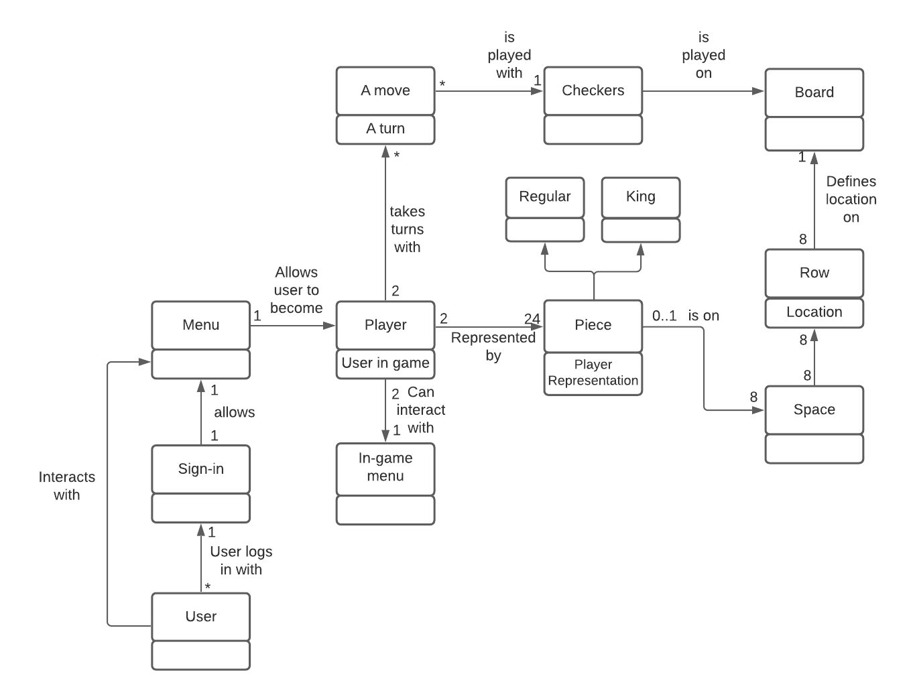
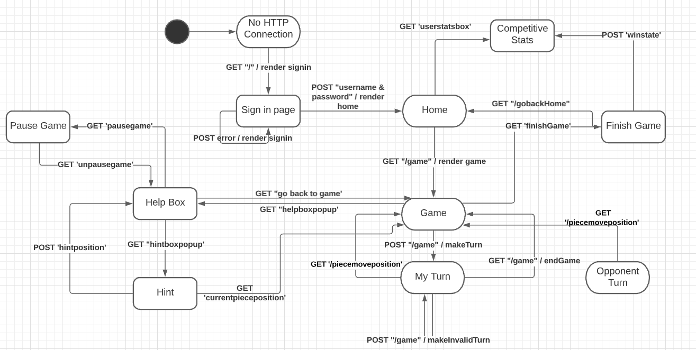

# PROJECT Design Documentation

## Team Information
* Team name: Team Rhamz
* Team members
  * Anh Nguyen
  * Rhamsez Thevenin
  * Sierra Tran
  * Phil Ganem
  * Mohammed Alam

## Executive Summary
WebCheckers is an application that users can sign in to play online Checkers
with other players. Using the Spark framework for Java, WebCheckers
provides users with a realtime experience challenging an opponent.

### Purpose
This project is a web-application of checkers. 
Users should be able to log-in, and play against other players.

### Glossary and Acronyms

| Term | Definition |
|------|------------|
| UI | User Interface |
| POJOs | Plain Old Java Objects |
| MVP | Minimal Viable Product |

## Requirements

This section describes the features of the application.

### Definition of MVP
1. Every player must sign-in before playing a game, and be able 
   to sign-out when finished playing.
2. Two players must be able to play a game of checkers based upon 
   the American rules.
3. Either player of a game may choose to resign, at any point, 
   which ends the game.

### MVP Features
- Sign In
- Start a Game
- Make Moves
- Win/Lose the Game
- Resign

### Roadmap of Enhancements
1. Player Help
2. Tournament Play

## Application Domain

This section describes the application domain.

The domain highlights the general flow of the application:
- The user signs in to be at the home page (menu)
  
- The user can then start a game (becoming a Player) or check player stats 
  for competitive mode
  
- The player can make a move to play the game
  
- The move communicates with the model which includes
  the Board, Row, Space, and Pieces
  
- The player plays the game

The most important entities of the domain model are the Player, Board, Row, 
Space, and Piece entities.

- Each set of 24 checker Pieces on the board represents a Player in the
  game. Players take a turn when they make a move which is played with
  Checkers which are on the board.
  
- Regular or King Pieces are on specific Spaces which belong to Rows which also
  builds the entire Board. In short, there can be zero or one Piece on each Space,
  there are 8 Spaces on each Row, and there are 8 Rows on a board.

## Architecture and Design

This section describes the application architecture.

### Summary

The following Tiers/Layers model shows a high-level view of the webapp's architecture.

As a web application, the user interacts with the system using a
browser.  The client-side of the UI is composed of HTML pages witharchi
some minimal CSS for styling the page.  There is also some JavaScript
that has been provided to the team by the architect.

The server-side tiers include the UI Tier that is composed of UI Controllers and Views.
Controllers are built using the Spark framework and View are built using the FreeMarker framework.  The Application and Model tiers are built using plain-old Java objects (POJOs).

Details of the components within these tiers are supplied below.

### Overview of User Interface

This section describes the web interface flow; this is how the user views and interacts
with the WebCheckers application.

So we start with our initial condition if the GET request doesn't render the page correctly. We then load on the sign-in page with GET "/" render sign-in. The sign-in page state was initially made with a piece of account information in mind, so if the user doesn't enter the right password, we would get the sign-in page again for them to input their information once again. 

The player is redirected to home once they successfully sign in, and the Post will send their info to check if sign-in is correct. Once in the home page state, the User will have options such as a button that will make a get request for a page that will display the user's stats. 

On the Home page, there will be an option to click the other player's button and be redirected into a game using the GET "/game request". In the game state, you will have several requests and options. 

Here in the Game state, you can make Post requests that will try to move checker pieces. You will have a GET request to update the board on your UI based on the board class, and we will be posting information such as the space you moved to. Based on whether or not it's your turn, your opponent will still be playing and modifying the board so we will have GET requests to update the Board as such from the Opponent's turn state. 

There is also a Help Menu state on the game, where you can pause your game and go into the Help Menu state which you access with a GET request. In that state, you can open another state called Pause game which will allow you to pause the game if you ever need to take a break. This is done by a GET request to the pause state and another back to the help menu state. Another option from the Help Menu is the Hint state. If you're stuck on Checkers, a Hint will be shown to help you decide your next move. We will be sending a GET request for the Hint state, and from the Hint state we will be Posting information, or in our case, the Hint the player can do. After that, we can close Hint by doing another Get request of the Help Menu, and another Get request to go back to our game will be played. 

So now we are playing the game and repeating the aforementioned requests. We now end up to where the game is finished. When the Game is finished we GET the Game Finished State, which is basically a screen showing the game has stopped and whatever the result is, then we POST information about the players into the Competitive stats page state that was mentioned before. This will update their wins/losses and other details. This can always be accessed back on the Home page. In the Finished game screen state, you have the option of wanting to go back home or directly to the user stats page. 

### UI Tier

The UI-tier components of the WebCheckers application are all controlled
by the WebServer class. It handles all GET and POST requests. All other
classes in the `ui` package implement the GET and POST Routes, and each
has its own purpose and implementation. Some of them do communicate with
each other since they are closely related such as `GetHomeRoute` and
`GetGameRoute`.

**Most of the flow of the UI-tier are described in the above statechart 
section, so this part will only highlight the more important routes in 
the UI-tier.**

The first important part of the UI-tier is getting the idle player in the 
lobby that is challenged by another player into the game that they're 
supposed to be in. The first player invokes `GetGameRoute` which creates
a game and sets certain parameters to signal `GetHomeRoute` to bring the
other player into that game. The first `GetGameRoute` invocation creates
the game with the opponent the player chose, then redirects the first
player to the `/game?gameID=[gameID]` which invokes `GetGameRoute` again.
The second invocation builds the View-Model map then renders it, which
gives the user the view of the game.

The second player (the opponent) is brought into the game by a check in
`GetHomeRoute` if there is a game and that player is in that game. They
get redirected to the same `/game?gameID=[gameID]` link which invokes
`GetGameRoute`, building the game view for the second player (opponent
view).

**State model for the Game View**

The second important part of the UI-tier is the gameplay of the WebCheckers
application.

The players in their turn can make moves which invoke `PostValidateMoveRoute`
that validates the moves they make following the American Checkers rules.
They can then submit their turn by clicking the button which invokes 
`PostSubmitTurnRoute` that validates the turn as a whole. Before submitting,
they can also back up their moves if they want; backing up a move invokes
`PostBackupMoveRoute`. Both players have the option to resign at anytime
they want which invokes `PostResignGameRoute` that ends the game and
declares the winner of the game. The state model for the process is below.

During the time the player that is not in the turn, there is a continuous
check that invokes `PostCheckTurnRoute` which checks if it is their turn yet.

### Application Tier
> _Provide a summary of the Application tier of your architecture. This
> section will follow the same instructions that are given for the UI
> Tier above._
#### Game
> Each game will have a red Player (a player with red checkers), a white player, and a board.
> The board will be shown differently for each player.
> The game has the ability to let players make moves, until the end game conditions are met.
#### PlayerLobby
> The player lobby holds all players who've signed into the application.

### Model Tier
> _Provide a summary of the Application tier of your architecture. This
> section will follow the same instructions that are given for the UI
> Tier above._

### Design Improvements
> _Discuss design improvements that you would make if the project were
> to continue. These improvement should be based on your direct
> analysis of where there are problems in the code base which could be
> addressed with design changes, and describe those suggested design
> improvements. After completion of the Code metrics exercise, you
> will also discuss the resutling metric measurements.  Indicate the
> hot spots the metrics identified in your code base, and your
> suggested design improvements to address those hot spots._

## Testing
> _This section will provide information about the testing performed
> and the results of the testing._

### Acceptance Testing
> _Report on the number of user stories that have passed all their
> acceptance criteria tests, the number that have some acceptance
> criteria tests failing, and the number of user stories that
> have not had any testing yet. Highlight the issues found during
> acceptance testing and if there are any concerns._

### Unit Testing and Code Coverage
> _Discuss your unit testing strategy. Report on the code coverage
> achieved from unit testing of the code base. Discuss the team's
> coverage targets, why you selected those values, and how well your
> code coverage met your targets. If there are any anomalies, discuss
> those._
