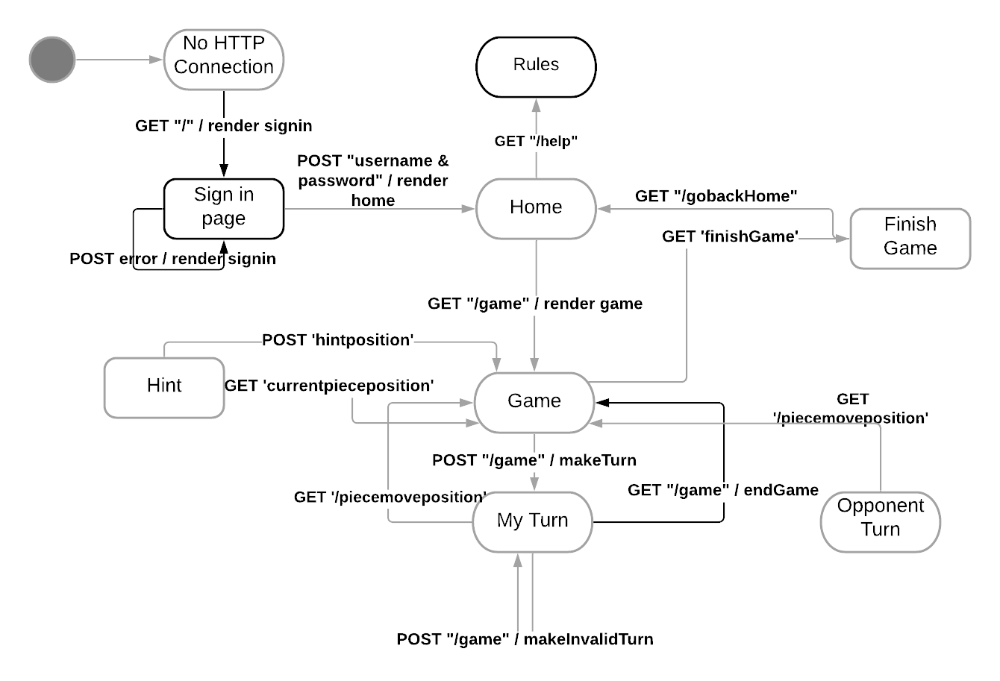
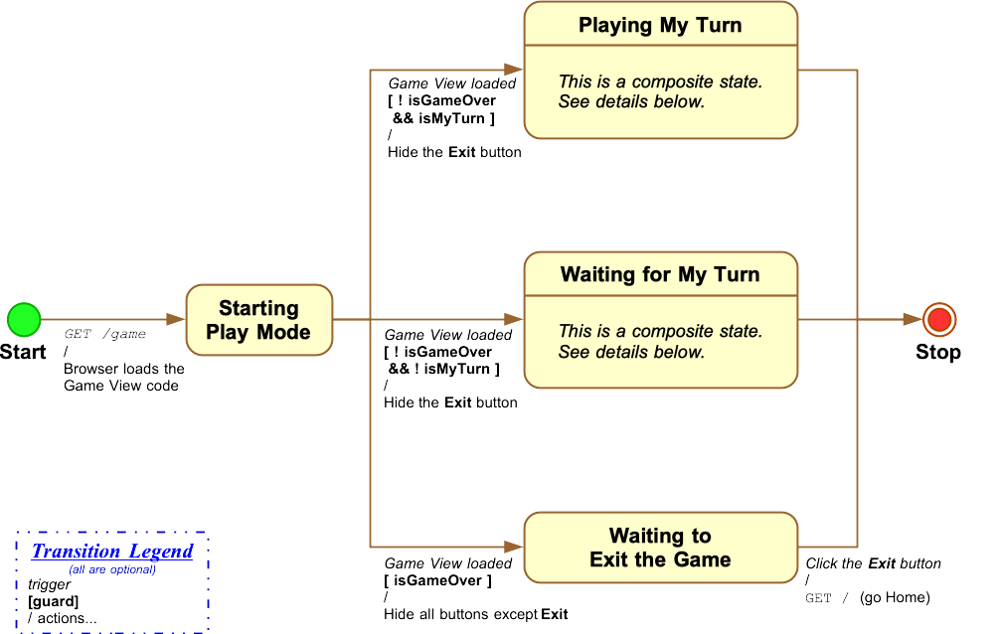
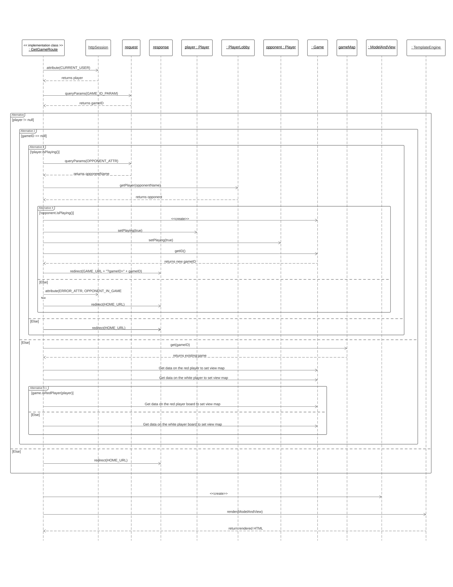
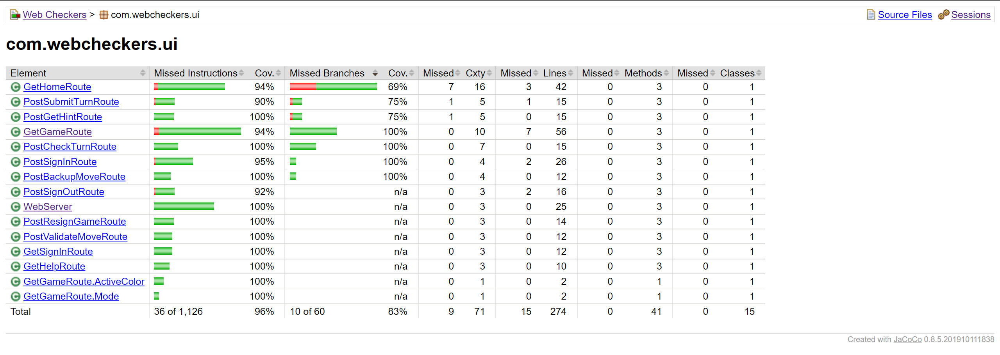
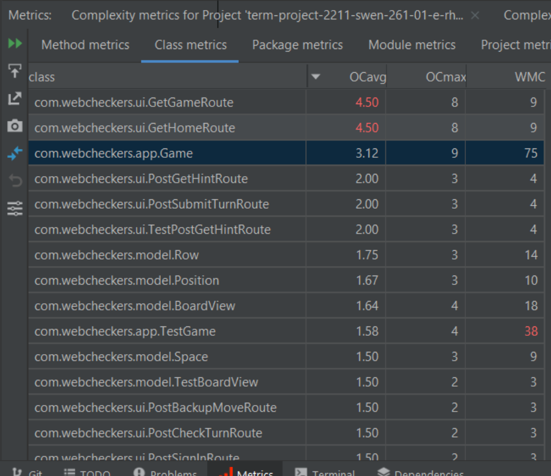
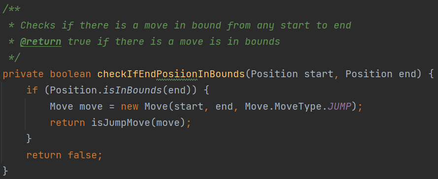
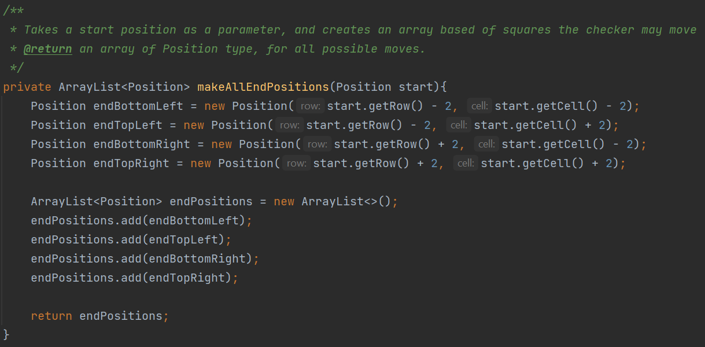

# PROJECT Design Documentation

## Team Information

* Team name: Team Rhamz
* Team members
    * Anh Nguyen
    * Rhamsez Thevenin
    * Sierra Tran
    * Phil Ganem
    * Mohammed Alam

## Executive Summary

WebCheckers is an application that users can sign in to play online Checkers with other players. Using the Spark
framework for Java, WebCheckers provides users with a realtime experience challenging an opponent.

### Purpose

This project is a web-application of checkers. Users should be able to log-in, and play against other players.

### Glossary and Acronyms

| Term | Definition |
|------|------------|
| UI | User Interface |
| POJOs | Plain Old Java Objects |
| MVP | Minimal Viable Product |

## Requirements

This section describes the features of the application.

### Definition of MVP

1. Every player must sign-in before playing a game, and be able to sign-out when finished playing.
2. Two players must be able to play a game of checkers based upon the American rules.
3. Either player of a game may choose to resign, at any point, which ends the game.

### MVP Features

- Sign In
- Start a Game
- Make Moves
- Win/Lose the Game
- Resign

### Roadmap of Enhancements

1. Player Help
2. Tournament Play

## Application Domain

This section describes the application domain.

The domain highlights the general flow of the application:

- The user signs in to be at the home page (menu)

- The user can then start a game (becoming a Player) or check player stats for competitive mode

- The player can make a move to play the game

- The move communicates with the model which includes the Board, Row, Space, and Pieces

- The player plays the game

The most important entities of the domain model are the Player, Board, Row, Space, and Piece entities.

- Each set of 24 checker Pieces on the board represents a Player in the game. Players take a turn when they make a move
  which is played with Checkers which are on the board.

- Regular or King Pieces are on specific Spaces which belong to Rows which also builds the entire Board. In short, there
  can be zero or one Piece on each Space, there are 8 Spaces on each Row, and there are 8 Rows on a board.

## Architecture and Design

This section describes the application architecture.

### Summary

The following Tiers/Layers model shows a high-level view of the webapp's architecture.

As a web application, the user interacts with the system using a browser. The client-side of the UI is composed of HTML
pages witharchi some minimal CSS for styling the page. There is also some JavaScript that has been provided to the team
by the architect.

The server-side tiers include the UI Tier that is composed of UI Controllers and Views. Controllers are built using the
Spark framework and View are built using the FreeMarker framework. The Application and Model tiers are built using
plain-old Java objects (POJOs).

Details of the components within these tiers are supplied below.

### Overview of User Interface

This section describes the web interface flow; this is how the user views and interacts with the WebCheckers
application.

So we start with our initial condition if the GET request doesn't render the page correctly. We then load on the sign-in
page with GET "/" render sign-in. The sign-in page state was initially made with a piece of account information in mind,
so if the user doesn't enter the right password, we would get the sign-in page again for them to input their information
once again.

The player is redirected to home once they successfully sign in, and the Post will send their info to check if sign-in
is correct. Once in the home page state, the User will have options such as a button that will make a get request for a
page that will display the user's stats.

On the Home page, there will be an option to click the other player's button and be redirected into a game using the
GET "/game request". In the game state, you will have several requests and options.

Here in the Game state, you can make Post requests that will try to move checker pieces. You will have a GET request to
update the board on your UI based on the board class, and we will be posting information such as the space you moved to.
Based on whether it's your turn, your opponent will still be playing and modifying the board, so we will have GET
requests to update the Board as such from the Opponent's turn state.

There is also a Help Menu state on the game, where you can pause your game and go into the Help Menu state which you
access with a GET request. In that state, you can open another state called Pause game which will allow you to pause the
game if you ever need to take a break. This is done by a GET request to the pause state and another back to the help
menu state. Another option from the Help Menu is the Hint state. If you're stuck on Checkers, a Hint will be shown to
help you decide your next move. We will be sending a GET request for the Hint state, and from the Hint state we will be
Posting information, or in our case, the Hint the player can do. After that, we can close Hint by doing another Get
request of the Help Menu, and another Get request to go back to our game will be played.

So now we are playing the game and repeating the aforementioned requests. We now end up to where the game is finished.
When the Game is finished we GET the Game Finished State, which is basically a screen showing the game has stopped and
whatever the result is, then we POST information about the players into the Competitive stats page state that was
mentioned before. This will update their wins/losses and other details. This can always be accessed back on the Home
page. In the Finished game screen state, you have the option of wanting to go back home or directly to the user stats
page.

### UI Tier

The UI-tier components of the WebCheckers application are all controlled by the WebServer class. It handles all GET and
POST requests. All other classes in the `ui` package implement the GET and POST Routes, and each has its own purpose and
implementation. Some of them do communicate with each other since they are closely related such as `GetHomeRoute` and
`GetGameRoute`.

**Most of the flow of the UI-tier are described in the above statechart section, so this part will only highlight the
more important routes in the UI-tier.**

The first important part of the UI-tier is getting the idle player in the lobby that is challenged by another player
into the game that they're supposed to be in. The first player invokes `GetGameRoute` which creates a game and sets
certain parameters to signal `GetHomeRoute` to bring the other player into that game. The first `GetGameRoute`
invocation creates the game with the opponent the player chose, then redirects the first player to
the `/game?gameID=[gameID]` which invokes `GetGameRoute` again. The second invocation builds the View-Model map then
renders it, which gives the user the view of the game.

The second player (the opponent) is brought into the game by a check in
`GetHomeRoute` if there is a game and that player is in that game. They get redirected to the
same `/game?gameID=[gameID]` link which invokes
`GetGameRoute`, building the game view for the second player (opponent view).

The second important part of the UI-tier is the gameplay of the WebCheckers application.

The players in their turn can make moves which invoke `PostValidateMoveRoute`
that validates the moves they make following the American Checkers rules. They can then submit their turn by clicking
the button which invokes
`PostSubmitTurnRoute` that validates the turn as a whole. Before submitting, they can also back up their moves if they
want; backing up a move invokes
`PostBackupMoveRoute`. Both players have the option to resign at anytime they want which invokes `PostResignGameRoute`
that ends the game and declares the winner of the game. The state model for the process is below.

During the time the player that is not in the turn, there is a continuous check that invokes `PostCheckTurnRoute` which
checks if it is their turn yet.

#### Sequence Diagram for the Start Game Functionality

Below is a sequence diagram of the `GetGameRoute` GET request. This is an important part of the game flow and requires a
lot of logical branching to build the view.

First, the route finds the player and the gameID from the session. If the player exists, the route tries to retrieve the
gameID. If there isn't a gameID, and the player is NOT playing, the route grabs the opponent player from the query
parameters and checks if the opponent is playing or not. If the opponent is not playing, a game is created and put in
the gameMap, and the player is redirected to the game page with the gameID, which means the next GET /game has a
different logical branch next time. However, if the opponent is playing, the route redirects the player back to the home
page because the opponent is already in a game, and they can't be challenged into two games at the same time.

When the gameID exists, the route builds the view map with the game found in the gameMap by querying the gameID from the
request. The board is then built with checker pieces, and the active color for the player is set. The route then returns
the view map render.

### Application Tier

The Application Tier follows as so. We have two organization classes, the Player Lobby and the Game classes.

Each game will have a red Player (a player with red checkers), a white player, and a board. The board will be shown
differently for each player. The game has the ability to let players make moves, until the end game conditions are met.

The player lobby holds all players who've signed into the application.

#### Game

The Game class is in play when the Checkers Game has already started. This class is used to manage user turns and
checker piece locations. The rules of checkers are situated in this class, giving us the logic to determine specific
player locations & posisble moves & incorrect moves based on that.

#### PlayerLobby

The Player Lobby class is used to manage the introductory processes in Web Checkers. A User can sign in efficiently and
be redirected to a Menu where they can choose to play against another player, or even be redirected onto another game.

### Model Tier

Users will be represented by instances of the entity class `Player`. Players have their own uniques names and a status
on whether or not they are currently playing a game. When two players are in a game against each other, the board will
be set up by the `BoardView` class. At the start of a game, `BoardView` will create a board by adding eight instances of
the `Row` class to it. Each row has eight instances of the `Space` class that alternate between the colors black and
white. Only black spaces are valid for moves and having pieces on them. A player starts with 12 regular pieces, which
have been created by the `Piece` class, that are either red or white. If a piece reaches the opposite end of the board,
they can change from a regular piece to a king piece. A position on the board is represented by the `Position` class.
When a player makes a move, it will be created by the `Move` class using the starting position, end position, and the
type of move it is.

### Design Improvements

I would think about creating more classes in the Application tier and Model tier to improve coherence. The Game class is
a little cluttered with all of the methods, but for now they all work.

## Testing

### Acceptance Testing

All user stories are tested before being sent to the Done checklist. This means that all acceptance criteria were
checked off by demoing the application and seeing if they match each acceptance criterion. No issues were found while
completing acceptance testing.

### Unit Testing and Code Coverage

Unit testing was done especially well and almost maximum code coverage for each component of the application. The basic
strategy was to study the code well for each class that needs to be tested to write such tests that would cover every
line of instruction and every branch of logic. The results are as follows.

#### Top Level Code Coverage

#### Application-Tier Code Coverage

#### Model-Tier Code Coverage

#### UI-Tier Code Coverage

## Code Metrics and Improvements

For Code Metrics, we only had problems with 4 classes. The GetGameRoute & GetHomeRoute classes fail the OCavg metric.
The TestGame class failed the MVC metric. And the Game class failed the OCavg & MVC metrics.

In the UI tiers, the GetGameRoute & GetHomeRoute classes, We looked over the complexity, and we didn't feel as if
anything needs to be implemented here because all the methods in those classes are as simple as can get, and there isn’t
anything that can be worked on, comments wise to fix the code nor simplify the number of lines. Most of the code is a
part of the Spark library and is all necessary, such as the vm.put() method. We also have a comment for each line, but
those are very necessary because the code gets hard to follow.

With that information, we can deduce that the only reason those 2 methods failed was that we have a big amount of
comments adding to our line count, so it’s different from our results. Other than that, a similar problem is in our Game
class. This class has a code metric error due to the complexity, but we feel as if the error is in the metric on this
one as well, and We have the proof to back it up. We took one section of the Game class and split it up into an old
commented-out code metric and a new Code Metric section.

With these divisions, two helper methods were added, one for making the end positions from a given start position on a
board, and making an Array List of positions surrounding each corner of the current position square. The other Helper
Method would be the fact that the position a checker piece might move to is in bounds. It takes the Start and End as
parameters, and makes a move class based on it, then applies the isInBounds method inside it to verify the move works
and returns true if so.

The aforementioned Helper Methods were applied, and a smaller Code Metrics score was achieved (3.22 to 3.12), which is
good, but the new code made was much harder for a user to read, because it brings the user in so many directions, that
we felt if it was all simplified, and it used for loops such used in the old method, it would be fine. Although the Java
Compiler understands the code better, we as humans do not. We felt the current code would be sufficient, instead of
making the code much larger, and less easy to follow. The time Complexity or Space Complexity has not changed either.

Another prominent error shown by the Code Metrics, is the warning sign that our gameMap in the Game class should be
finalized, as that is not the case, we are changing the method, and removing data out of this Hashmap. We even have the
code for changing this hashmap in the Game class itself, so there is no reason we should be getting this error
whatsoever.

Our final Code Metric that did not meet IntelliJ's expectations would be the TestGame class. The Metrics that are
applied to the Model tier & the test should not be the same. They are fundamentally different and do not achieve nor
measure the same thing. The Model tier is supposed to be simplified to make the code perform the same but have better
complexity and be easier to follow. While the somewhat opposite is true for the Testing classes. The Code is supposed to
be extensive enough to measure all cases and scenarios that can apply to our code. The error we got from Game in Code
Metrics can apply to its test as well. So all in all the testing module should take as many measures and does not
violate any principles we learned in class, we feel as if there is an error in the metric for this one as well.

